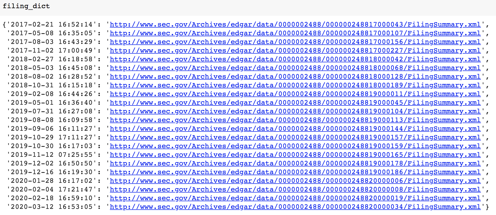
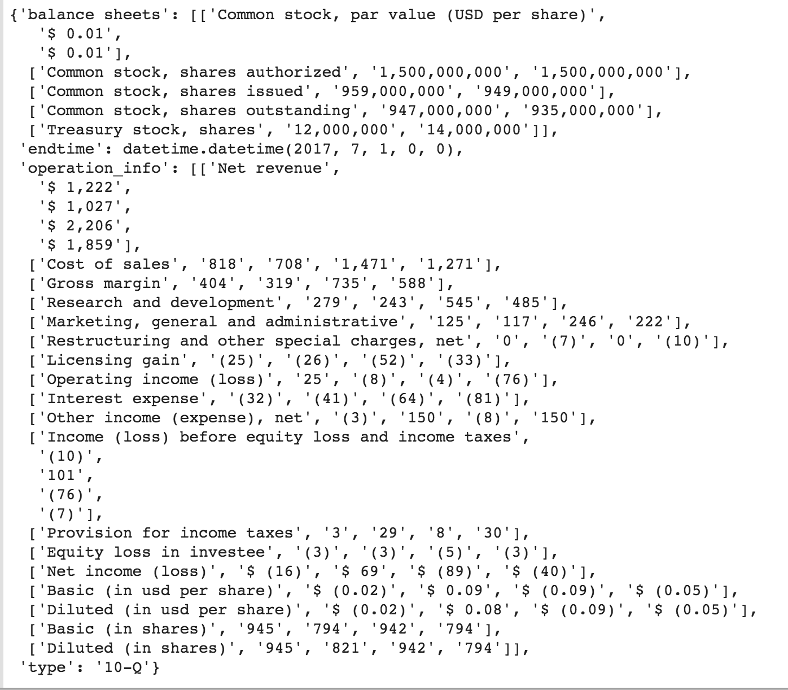

# Web crawler for financial statement data from US securities and exchange
The ultimate goal of this project is providing 'balance sheets' and 'statements of operation' by scaping in U.S securities and exchange commission. 

## Installation

```bash
pip3 install requests
pip3 install beautifulsoup4
```
## Result (so far)
1. get filingSummary.xml url


2. statement of operations dictionary


3. quarterly statement

